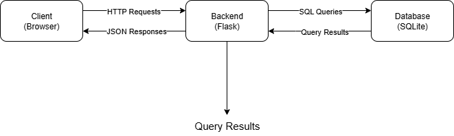

# Архітектурна діаграма

## Поточна архітектура

## Компоненти системи

### Client (Frontend)
- **HTML/CSS/JavaScript** - користувацький інтерфейс
- **Відповідає за**: відображення даних, обробку кліків, відправку запитів
- **Технології**: Vanilla JavaScript, CSS Grid/Flexbox

### Backend (Flask API)
- **Python Flask** - обробка бізнес-логіки
- **Відповідає за**: обробку HTTP запитів, роботу з БД, валідацію даних
- **Ендпоінти**: 
  - `GET /signs` - всі знаки
  - `GET /signs/<category>` - знаки за категорією
  - `GET /signs/<id>` - деталі знака (майбутній)

### Database (SQLite)
- **SQLite** - зберігання даних
- **Відповідає за**: постійне зберігання інформації про дорожні знаки
- **Таблиці**: 
  - `road_signs` - інформація про знаки

## Майбутні модулі
- **Auth Service** - аутентифікація користувачів
- **Admin Panel** - управління контентом
- **Search Engine** - розширений пошук
- **Image Storage** - зберігання зображень знаків