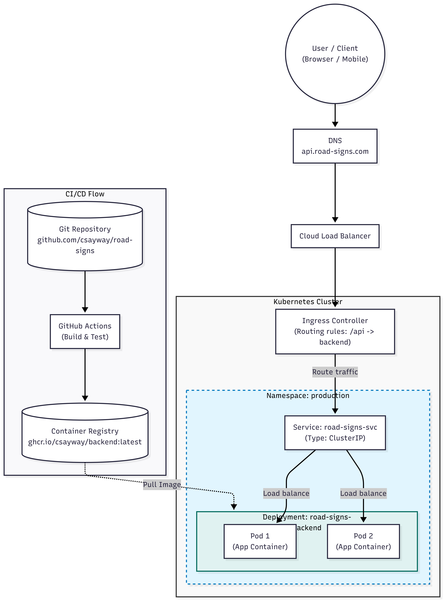

# Опис архітектури сервісу "Road Signs API"

**Сервіс:** Я моделюю бекенд-частину додатку "Довідник дорожніх знаків" (REST API на Python/Flask), який обробляє запити на отримання та створення знаків.

**Розміщення:** Сервіс розміщується у Kubernetes-кластері в ізольованому просторі імен (Namespace) з назвою production.

**Зовнішній трафік:** Клієнт звертається за доменом api.road-signs.com. Трафік проходить через Cloud Load Balancer і потрапляє на Ingress Controller, який за правилами маршрутизації перенаправляє запити до внутрішнього сервісу road-signs-svc.

**Масштабування:** У Deployment закладено 2 репліки (Pod-и) для забезпечення базової відмовостійкості (High Availability): якщо один Pod впаде або оновлюватиметься, другий продовжить обробляти трафік.

**Delivery Pipeline:** Код зберігається на GitHub. Після команди git push запускається GitHub Actions, який збирає Docker-образ і пушить його в GHCR (GitHub Container Registry). Kubernetes автоматично скачує цей образ із реєстру під час старту або оновлення Pod-ів.

